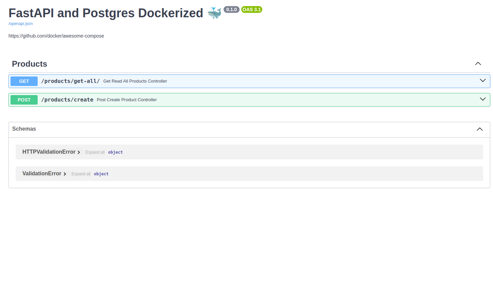

## Compose sample application
### Python/FastAPI and Postgres

Project structure:
```
├── Dockerfile
├── compose.yaml
├── requirements.txt
├── app
│   ├── main.py
│   ├── __init__.py
│   ├── controller
│   │   ├── __init__.py
│   │   └── product_controller.py
│   ├── services
│   │   ├── __init__.py
│   │   └── product_service.py
│   ├── configuration
│   │   ├── __init__.py
│   │   └── database.py
│   ├── model
│       ├── __init__.py
│       └── product_model.py

```

Add file `.env`, for exemple:
```
# Postgres configurations
POSTGRES_USER=postgres
POSTGRES_PASSWORD=root1914
POSTGRES_DB=productdb

# API configurations
DATABASE_URL=postgresql+psycopg2://postgres:root1914@db:5432/productdb
```

[_compose.yaml_](compose.yaml)
```
version: '3.8'

services:
  db:
    image: postgres:13
    container_name: database_container
    environment:
      POSTGRES_USER: ${POSTGRES_USER}
      POSTGRES_PASSWORD: ${POSTGRES_PASSWORD}
      POSTGRES_DB: ${POSTGRES_DB}
    ports:
      - "5433:5432"
    volumes:
      - postgres_data:/var/lib/postgresql/data

  api:
    build:
      context: .
      dockerfile: Dockerfile
    container_name: api_container
    environment:
      DATABASE_URL: postgresql+psycopg2://${POSTGRES_USER}:${POSTGRES_PASSWORD}@db:5432/${POSTGRES_DB}
    ports:
      - "8000:8000"
    depends_on:
      - db

volumes:
  postgres_data:

```

## Deploy with docker compose

```shell
docker-compose up -d --build
```
## Expected result

Listing containers must show one container running and the port mapping as below:
| CONTAINER ID  | IMAGE                  | COMMAND                           | CREATED          | STATUS          | PORTS                                      | NAMES             |
|---------------|------------------------|-----------------------------------|------------------|-----------------|--------------------------------------------|-------------------|
| b75e5b6747a8  | fastapi-postgres-api   | "fastapi run app/main:app"         | 13 minutes ago    | Up 13 minutes   | 0.0.0.0:8000->8000/tcp, :::8000->8000/tcp  | api_container     |
| d2a5be9f350a  | postgres:13            | "docker-entrypoint.sh postgres"    | 13 minutes ago    | Up 13 minutes   | 0.0.0.0:5433->5432/tcp, :::5433->5432/tcp  | database_container|


After the application starts, navigate to `http://localhost:8000/docs` in your web browser and you should see swagger-ui:



**Stop and remove the containers**

```
$ docker compose down
```

**List volumes**

```
docker volume ls
```

**Remove volume**

```
docker rm <volume_name>
```
