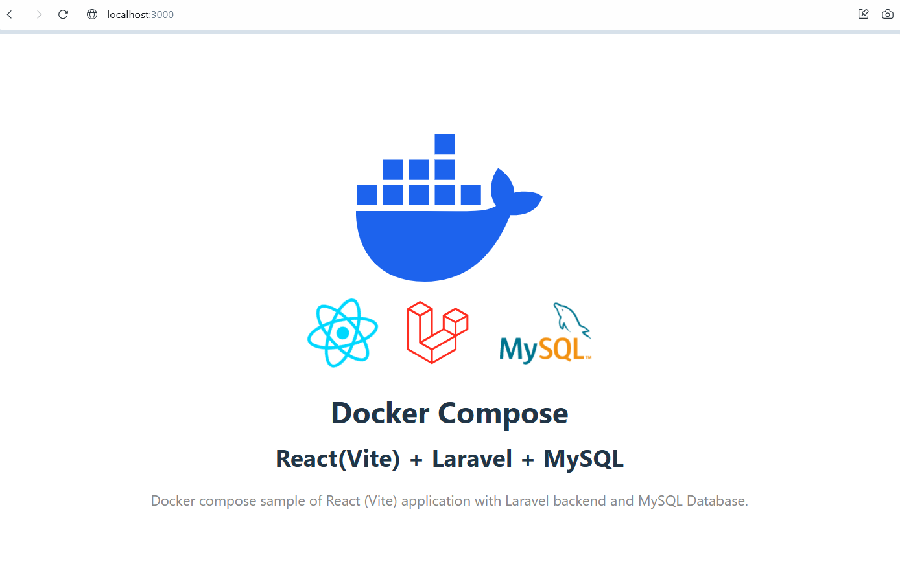

## Compose sample application
### React(Vite) application with a Laravel backend and a MySQL database

Project structure:
```
.
├── backend
│   ├── ...
│   └── Dockerfile
├── db
│   └── password.txt
├── compose.yaml
├── frontend
│   ├── ...
│   └── Dockerfile
└── README.md
```

[_compose.yaml_](compose.yaml)
```
services:
  backend:
    build: backend
    ...
  db:
    image: mysql:lts
    ports:
      - 8000:80
    ...
  frontend:
    build: frontend
    ports:
      - 3000:3000
    ...
```
The compose file defines an application with three services `frontend`, `backend` and `db`.
When deploying the application, docker compose maps port 3000 of the frontend service container to port 3000 of the host and port 80 of the backend service container to port 8000 of the host as specified in the file.
Make sure the ports 3000 and 8000 on the host are not already being in use.

## Deploy with docker compose

```
$ docker compose up -d
✔ Network react-laravel-mysql_laravel-mariadb  Created    0.1s
✔ Network react-laravel-mysql_vite-laravel     Created    0.1s
✔ Container react-laravel-mysql-db-1           Healthy    7.7s
✔ Container react-laravel-mysql-backend-1      Started    8.4s
✔ Container react-laravel-mysql-frontend-1     Started    8.7s
```

## Expected result

Listing containers must show three containers running and the port mapping as below:
```
$ docker ps
CONTAINER ID   IMAGE                          COMMAND                  CREATED         STATUS                   PORTS                                         NAMES
c842d6bec933   react-laravel-mysql-frontend   "docker-entrypoint.s…"   4 minutes ago   Up 4 minutes             3306/tcp, 0.0.0.0:3000->3000/tcp, 33060/tcp   react-laravel-mysql-frontend-1
c84c2a303e91   react-laravel-mysql-backend    "/usr/local/bin/entr…"   4 minutes ago   Up 4 minutes             0.0.0.0:8000->80/tcp                          react-laravel-mysql-backend-1
44f8a005982e   mysql:lts                      "docker-entrypoint.s…"   4 minutes ago   Up 4 minutes (healthy)   3306/tcp, 33060/tcp                           react-laravel-mysql-db-1
```

After the application starts, navigate to `http://localhost:3000` in your web browser to see this React home page.


Stop and remove the containers
```
$ docker compose down
✔ Container react-laravel-mysql-frontend-1     Removed    0.8s
✔ Container react-laravel-mysql-backend-1      Removed    11.3s
✔ Container react-laravel-mysql-db-1           Removed    3.2s
✔ Network react-laravel-mysql_vite-laravel     Removed    0.8s
✔ Network react-laravel-mysql_laravel-mariadb  Removed    0.5s
```
